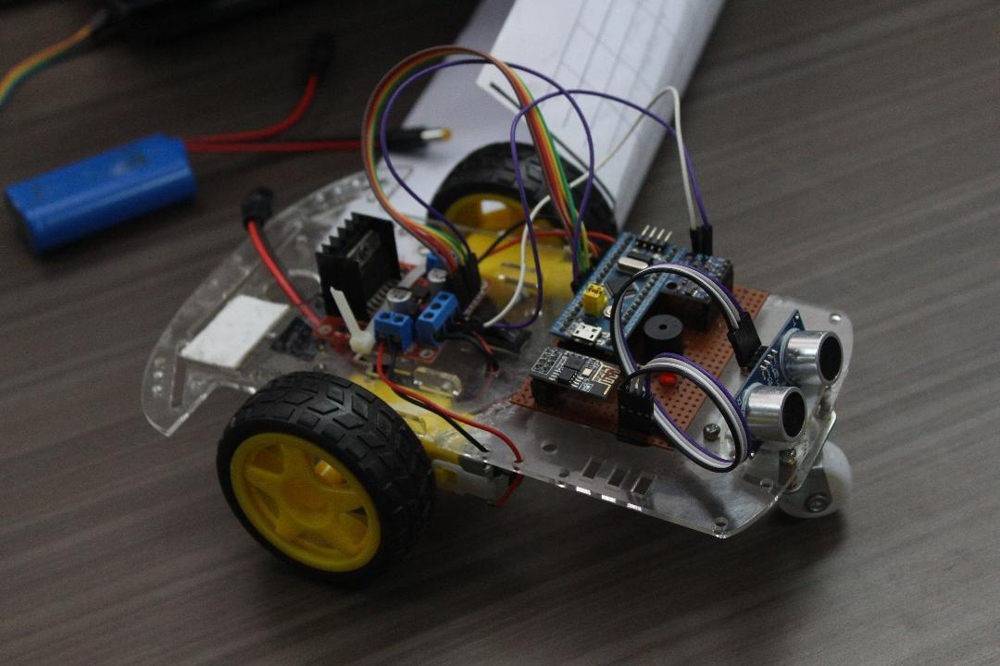
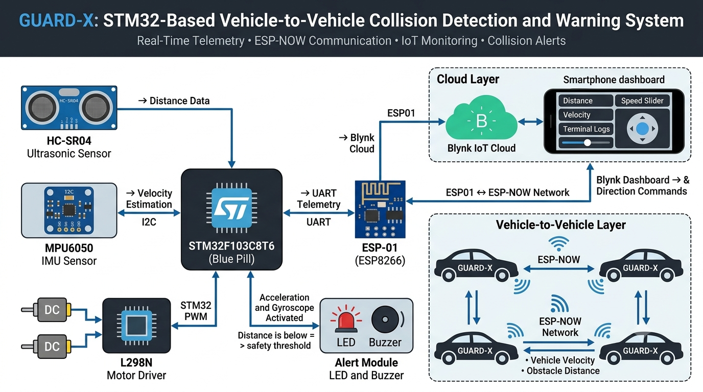
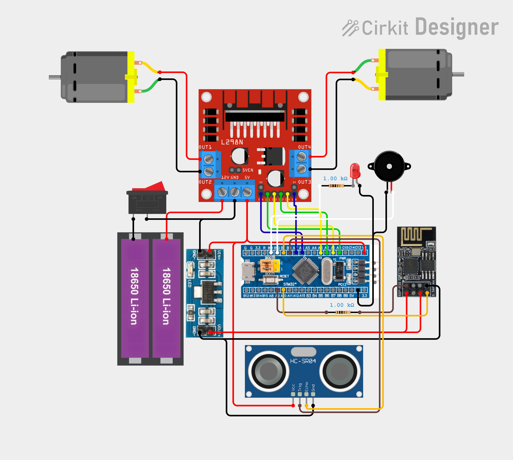

  
  
  
  
  

# 🚗 Guard-X – Vehicle-to-Vehicle Early Collision Detection System

  

**Guard-X** is a Vehicle-to-Vehicle (V2V) Early Collision Detection System designed to improve road safety through real-time telemetry exchange and obstacle awareness. The system utilizes STM32 microcontrollers, ESP-NOW wireless communication, ultrasonic sensing, and IoT connectivity to detect potential hazards and alert drivers before collisions occur.

## 📸 Project Overview

- **Architecture:** Modular Embedded Firmware Design
- **STM32**-based V2V collision detection and warning system.
- **ESP-NOW** wireless communication between nearby vehicles.
- Real-time obstacle detection using **HC-SR04** ultrasonic sensor.
- Velocity estimation using **MPU6050** IMU.
- Blynk IoT integration for control, monitoring, and alerts.

## 👥 Team & Contributors

Meet the team behind **Guard-X**:

- 🚀 [**Hariharan**](https://github.com/HariharanS-22) 
- 🛠️ [**Pragadeesh**](https://github.com/pragadeesh-raja)
- 🧠 [**Sudhiksha**](https://github.com/sudhiksha)

## ⚙️ System Architecture

  

## 🔧 Hardware

  

<table>
  <tr>
    <th>Component</th>
    <th>Purpose</th>
  </tr>
  <tr>
    <td>STM32F103C8T6</td>
    <td>Main Controller</td>
  </tr>
  <tr>
    <td>ESP-01 (ESP8266)</td>
    <td>Wi-Fi & ESP-NOW Communication</td>
  </tr>
  <tr>
    <td>HC-SR04</td>
    <td>Obstacle Distance Measurement</td>
  </tr>
  <tr>
    <td>MPU6050</td>
    <td>Velocity Estimation</td>
  </tr>
  <tr>
    <td>L298N</td>
    <td>Motor Driver</td>
  </tr>
  <tr>
    <td>DC Gear Motors</td>
    <td>Vehicle Propulsion</td>
  </tr>
  <tr>
    <td>LED</td>
    <td>Visual Collision Warning</td>
  </tr>
  <tr>
    <td>Buzzer</td>
    <td>Audible Collision Warning</td>
  </tr>
  <tr>
    <td>Battery Pack</td>
    <td>Power Source</td>
  </tr>
</table>

---

## 🧠 Features

- **Vehicle-to-Vehicle Communication**
  
  Exchange velocity and obstacle-distance information between nearby vehicles using ESP-NOW.

- **Collision Detection**
  
  Detect obstacles using ultrasonic sensing and generate alerts when vehicles enter unsafe proximity.

- **IoT Dashboard Integration**
  
  Monitor telemetry and control vehicle movement remotely through Blynk IoT.

- **Wireless Telemetry Broadcast**
  
  Share vehicle status periodically with surrounding Guard-X nodes.

- **Real-Time Driver Alerts**
  
  LED and buzzer activation when collision risk is detected.

- **Modular Embedded Firmware**
  
  Separate drivers for communication, sensing, motor control, and alert management.

## ⚖️ License

This project is released under a **Custom License**.  See [`LICENSE`](./LICENSE) for more details.

Public viewing is allowed, but **forking and reuse require prior permission**.

